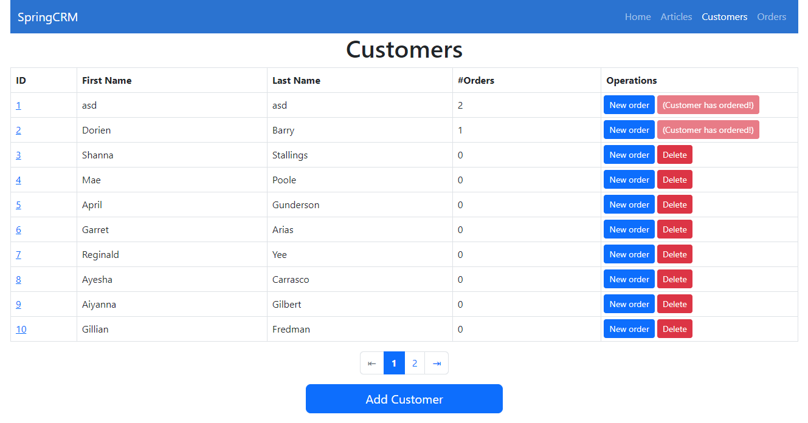
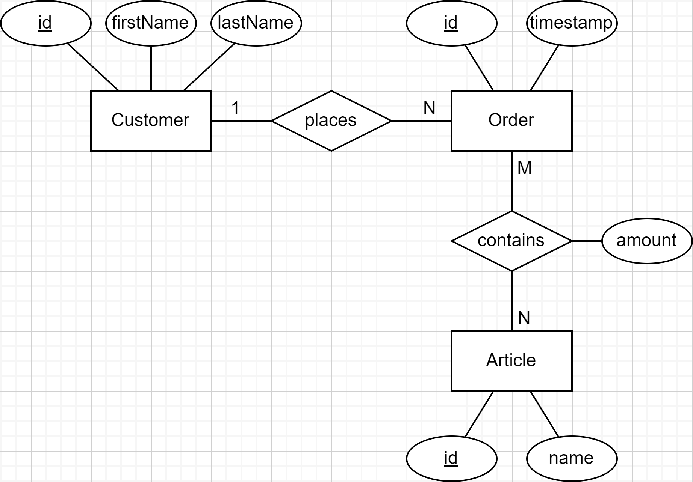
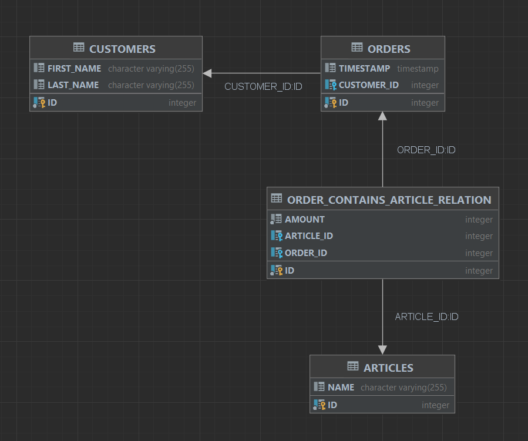

# SpringCRM

An example application in Spring containing Articles, Customers and Orders.

## Features

- **Simple CRM:** Add and remove Articles, Customers and Orders
- **Pagination:** Page-by-page listings
- **Database initialization with JPA:** Schema generated from Model
- **Bootstrap:** Frontend
- **GitHub workflow:** Build, test and upload JAR artefact after each commit

## Database

### Entity-Relationship Diagram

### Database Schema

## Links

- **JPA vs. JDBC:** https://stackoverflow.com/a/11881732
- **Spring Test Annotations:** https://stackoverflow.com/a/59097848
- **Repository Interfaces:** https://stackoverflow.com/q/14014086
- **Unit testing Spring Data JPA repositories:** https://stackoverflow.com/q/23435937

## TODO

- tests
- add DTO mapping (https://www.baeldung.com/entity-to-and-from-dto-for-a-java-spring-application)
- add proper validation
- error handling for non-existent IDs
- validate HTML
- test mobile viewport
- create release (JAR)
- custom error page